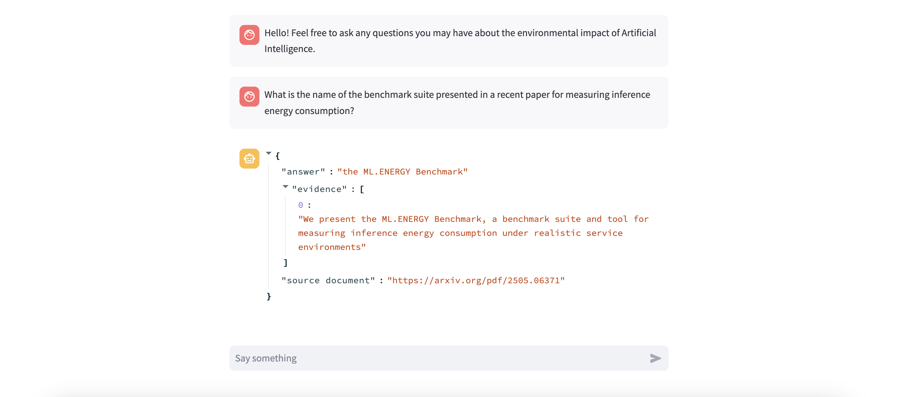

# WattBot – RAG Powered Chatbot to Answer Questions About the Environmental Impact of AI Systems



Wattbot is a full-stack project designed to help researchers, engineers and policy makers derive actionable insights from scattered academic knowledge regarding the environmental impact of AI systems. 

## Features
- Ask the Streamlit chatbot a relevant question after providing it with a valid OpenAI API key. 
- It will respond with an LLM aided answer along with the specific document it found the answer.
- If the question falls outside the scope of the data provided to the model, it will state this. 

## Tech Stack
- **Frontend:** Streamlit
- **Backend:** Python, Pandas, LLM APIs
- **Data and Database Management:** Mistral OCR, LlamaIndex (for chunking and embedding)

## How to Experiment with the Bot
1. [Install Python 3.11+](https://www.python.org/downloads/)
2. Install dependencies
```bash
pip install -r requirements.txt
```
3. Run the Streamlit website
```bash
streamlit run app.py
```

## Model Accuracy Note
This chatbot leverages a limited dataset of around 20 documents. As such, it may return "out of scope" for questions that seem relevant but fall out of scope. This is also a work in progress, and I am currently working on modifying parameters to improve performance. 
