# Understanding the Performance and Estimating the Cost of LLM Fine-Tuning

Yuchen Xia^{1} Jiho Kim^{2} Yuhan Chen^{1} Haojie Ye^{1} Souvik Kundu^{3} Cong (Callie) Hao^{2} Nishil Talati^{1} [ ^{1}University of Michigan ^{2}Georgia Institute of Technology ^{3}Intel Labs ]

###### Abstract

Due to the cost-prohibitive nature of training Large Language Models (LLMs), fine-tuning has emerged as an attractive alternative for specializing LLMs for specific tasks using limited compute resources in a cost-effective manner. In this paper, we characterize sparse Mixture of Experts (MoE) based LLM fine-tuning to understand their accuracy and runtime performance on a single GPU. Our evaluation provides unique insights into the training efficacy of sparse and dense versions of MoE models, as well as their runtime characteristics, including maximum batch size, execution time breakdown, end-to-end throughput, GPU hardware utilization, and load distribution. Our study identifies the optimization of the MoE layer as crucial for further improving the performance of LLM fine-tuning. Using our profiling results, we also develop and validate an analytical model to estimate the cost of LLM fine-tuning on the cloud. This model, based on parameters of the model and GPU architecture, estimates LLM throughput and the cost of training, aiding practitioners in industry and academia to budget the cost of fine-tuning a specific model.

## I Introduction

Large Language Models (LLMs) are widely utilized in Natural Language Processing (NLP) *[1]*. Modern LLMs typically possess billions to trillions of parameters, necessitating extensive time and resources for training. For instance, the estimated cost of training OpenAI’s GPT-4 model exceeds $100 million, rendering it financially prohibitive for most small-to-medium size enterprises and the academic community *[2]*. Given the open-sourcing of numerous pre-trained LLMs (e.g., LLAMA *[3]* and Mixtral *[4]*), fine-tuning has emerged as an attractive alternative for further specializing these models in a cost-effective manner *[5]*. Given the learning ability of pre-trained models, it is feasible to use a domain-specific dataset to align the desired behaviors of LLMs through supervised fine-tuning on instruction-following tasks *[6]*. Unlike pre-training, fine-tuning can be conducted in a resource-constrained environment, typically using one or a few GPUs. Consequently, fine-tuning presents a compelling case for applications such as specialized question answering within enterprises, legal document analysis and drafting, healthcare/medical research, technical and IT support, among others *[7]*.

This paper characterizes LLM fine-tuning with two primary objectives: (1) understanding the performance characteristics of LLM fine-tuning, and (2) developing an analytical model to estimate the cost of fine-tuning on the cloud. Given our focus on cost-efficient LLM fine-tuning, we concentrate on fine-tuning sparse Mixture-of-Expert (MoE) models. Specifically, we employ an attention-based MoE model, Mixtral *[4]*, and a state-space MoE model, BlackMamba *[8]*. Using these models and two domain-specific datasets for mathematics and common-sense question-answering, we conduct an in-depth profiling study to understand their performance characteristics with a single GPU. We compare the dense and sparse counterparts of the investigated MoE models to evaluate their learning rates and runtime performance. Our investigation covers memory consumption, maximum batch size supported within a single GPU memory budget, execution time breakdown and bottlenecks, overall throughput, microarchitectural performance counters, and runtime load distribution. The insights gained from our study are used to develop and validate an analytical model to estimate the cost.

Our characterization uncovers the following unique insights. (1) Fine-tuning can be achieved in less than 10 epochs, and sparse MoE model that activates a subset of experts can learn as well as its dense counterparts. (2) MoE layer consumes the highest fraction of execution time in LLM fine-tuning; optimizing MoE layer performance is key to improving the overall cost of LLM fine-tuning. (3) Sparse MoE model improves end-to-end throughput by supporting a larger batch size. Given similar learning abilities of sparse and dense models, it is desired to use a sparse MoE model for cost-effective fine-tuning. (4) The workload becomes compute bound by increasing batch size; improving compute resources will increase performance. (5) Fine-tuning sparse model leads to more load imbalance.

Based on these insights, we create an analytical model to estimate the cost of LLM fine-tuning based on model size, dataset size, and GPU architecture. First, we estimate the maximum batch size for a given GPU memory, then compute fine-tuning throughput. We validate this throughput with experimental results, showing an RMSE of less than 0.55. Using the estimated throughput, our model calculates the fine-tuning cost for different cloud providers.

The contributions of this paper are as follows.

- Make a case for LLM fine-tuning for specializing pre-trained models in a cost-effective manner.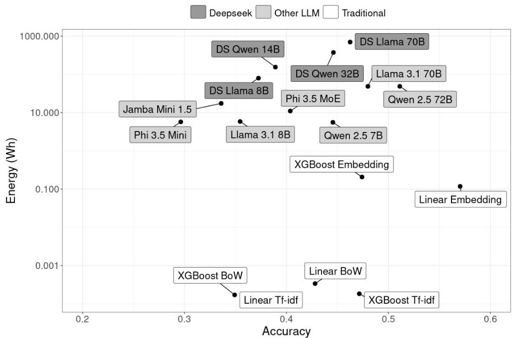
Fig. 1. LLM model overview. We evaluate accuracy, throughput, runtime, and GPU characterization for different models, input datasets, and fine-tuning sparsity. The different colored expert boxes in MoE layer means different sets of experts are activated according to the input token.

- A detailed accuracy and runtime performance analysis to understand the LLM fine-tuning workload behavior.
- Design and validation of an analytical model to estimate the cost of LLM fine-tuning in the cloud.

# II. BACKGROUND

# A. LLM and Finetuning

The decoder-only Transformer is designed to handle tasks where the output generation depends solely on the preceding tokens, making it particularly suited for auto-regressive tasks such as language modeling and text generation [9]. In the classic decoder-only Transformer design, multiple decoder layers are connected in sequence. Each decoder layer consists of a self-attention block followed by a feed-forward network (FFN). Fig. 1 presents an overview of the decoder-only Transformer model with a Mixture-of-Experts (MoE) design. In this model, the FFN layers are divided into several smaller FFNs, referred to as experts, which are sparsely activated by a gating mechanism. The self-attention block can also be replaced with a Mamba layer to improve performance in sequence modeling (a model known as state-space model). LLMs like GPT [10], [11], LLaMA [3], Claude [12], Mistral [13] have demonstrated their ability to excel in many natural language processing (NLP) tasks Training an LLM model from scratch requires a large amount of hardware resources and budget.

Fine-tuning LLMs allows organizations to harness the full potential of advanced AI systems by tailoring them to specific tasks and domains. This customization involves training the model on domain-specific data, enabling it to understand and generate content that aligns closely with the unique needs of the users. For instance, in the healthcare sector, a fine-tuned LLM can assist in diagnosing conditions by interpreting patient data and medical literature with high precision. Another attractive feature of fine-tuning LLMs is that it can be achieved at a cost-efficient manner. While pretraining LLMs require thousands of GPU hours, fine-tuning can be achieved using a handful of GPUs in a relatively short

TABLEI LLM MODELS

|   | #params | Mem consump. | #layers | #MoE layer  |
| --- | --- | --- | --- | --- |
|  Mixtral | 47B | 23.35GB | 32 | 8  |
|  BlackMamba | 2.8B | 5.6GB | 18 | 8  |

TABLE II DATASETS

|   | #queries | m. seq len | type  |
| --- | --- | --- | --- |
|  Commonsense_15K (CS) | 15K | 79 | Common Sense  |
|  Math_14K (MATH) | 14K | 174 | Math  |
|  Hellaswag (HE) | 10K | 272 | Common Sense  |
|  GSM8K (GS) | 1.3K | 148 | Math  |

amount of time [6]. This work uses case study of mathematics and common-sense question-answer datasets to demonstrate the fine-tuning process of LLMs.

# B. LoRA

Low-Rank Adaption (LoRA) is a technique that freezes the pre-trained model weights and injects trainable rank decomposition into layers of the transformer architecture [14]. LoRA significantly reduces the number of parameters, thereby decreasing the GPU memory footprint. LoRA can be used independently of the aforementioned fine-tuning techniques. In this work, we apply QLoRA [15] to the Mixtral-8x7B model [4]; more details are provided in §III.

# C. Mixture of Experts (MoE)

The quality of an LLM is highly related to its scale. Given a fixed computation budget, it is often desirable to train a model with more parameters to achieve higher accuracy. Mixture-of-Experts (MoE) is a technique that, instead of using one large model for all tasks, combines multiple expert sub-networks into a single, large model. As shown in Fig. 1, with MoE, different sets of experts are selectively activated for different tokens. This approach can significantly reduce the amount of computation required for both training and inference, enabling the scaling up of model size and achieving better model accuracy [16].

# III. EXPERIMENTAL SETUP

Models. We fine-tune two pre-trained MoE models, Mixtral-8x7B (Mixtral for short) [4] and BlackMamba-630M/2.8B (BlackMamba for short) [8]. The details of these models are shown in Table I. Both models incorporate eight experts in their MoE layers. For dense fine-tuning, all experts are activated, whereas for sparse fine-tuning, only the top two experts are selected for each token.

These models differ significantly in their transformer architectures and sizes. Mixtral is a conventional MoE transformer model with a total of 47 billion parameters. In contrast, BlackMamba is a state-space model that replaces all attention layers with mamba layers and has only 2.8 billionparameters. We fine-tune the full BlackMamba model (i.e., original weight matrices), whereas employed QLoRA [15] for parameter-efficient fine-tuning (PEFT) on Mixtral due to GPU memory capacity budget. For QLoRA, we target the MoE layers, including the routers, and set the rank of the LoRA modules to 16. We enable FlashAttention2 [17] during Mixtral fine-tuning for enhanced efficiency. Moreover, we use gradient checkpointing [18] to save memory usage.

Datasets. Our fine-tuning process is implemented in PyTorch using the LLaMA-Factory framework [19], with a learning rate of 5e-5 and 10 epochs. Both models were finetuned on two datasets focused on different tasks: commonsense_15k (CS) and Math_14k (MATH), which address commonsense reasoning and arithmetic reasoning respectively (provided by LLM-adapters [20]). The details of datasets are used in Table II. For evaluation, we tested the models on GSM8K [21] for arithmetic reasoning and HE [22] for commonsense reasoning. Each dataset consists of thousands of queries. We define a query as the concatenation of a prompt and its ground-truth answer, which is feed to LLMs for fine-tuning.

Profiling experiments. We evaluate the fine-tuning process from both software and hardware perspectives. The software evaluation includes an end-to-end assessment of the fine-tuning process and measures the performance of the two models on various tasks post-fine-tuning. Using PyTorch, we provide essential algorithm-level information such as test accuracy, training throughput, and layer-level latency breakdown. The hardware evaluation offers a detailed analysis of GPU performance. Utilizing NVIDIA Nsight Compute [23], we gather kernel-level information, including SM utilization, memory utilization, and kernel latency. These metrics collectively offer a comprehensive overview of the models' performance, capturing both high-level algorithmic efficiency and detailed hardware utilization. Software evaluation is dataset-dependent, and we will show the test accuracy and fine-tuning throughput by utilizing both datasets. In contrast, hardware evaluation is dataset-independent as these workload characteristics do not depend on runtime data. Because profiling is time-consuming (approximately  $10,000 \times$  costlier compared to a native run without the profiler enabled), we manually set the batch size and sequence length to facilitate a more direct and efficient profiling process.

We present the sequence length distribution for the CS and MATH datasets in Fig. 2. The median sequence length is 79 for CS and 174 for MATH. Therefore, we select a sequence length of 128 for the hardware evaluation section to achieve an approximate profiling effect. We also show a sensitivity study by varying sequence length to demonstrate its effect on performance.

GPU platform. Our study is focused on characterizing the LLM fine-tuning process on a resource-constrained environment. Therefore, we focus on fine-tuning these models on a single GPU. Specifically, we conduct our experiments using

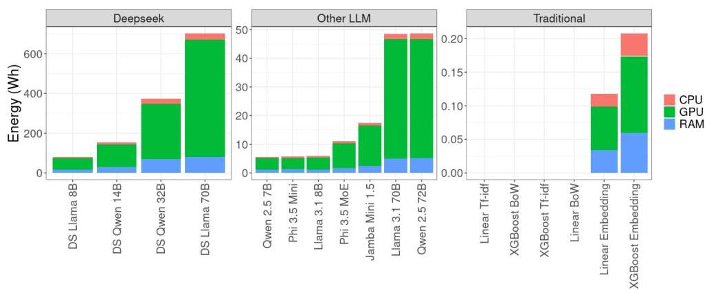
Fig. 2. Sequence length distribution for evaluated datasets.

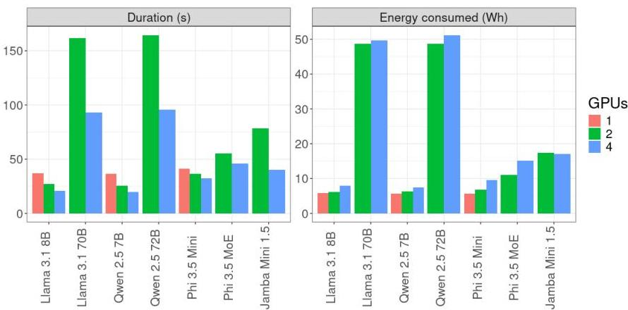
Fig. 3. Testing accuracy of Mixtral and BlackMamba. Both models are evaluated on two datasets Hellaswag (HE) and GSM8K (GS), using dense and sparse fine-tuning.

NVIDIA A40 GPU with Ampere architecture. The GPU has 48GB memory. While our profiling study is based on this particular GPU, we show the versatility of our analytical model by validating our model against three other GPU with different sizes of compute and memory resources: (1) A100 GPU with 40GB memory, (2) A100 GPU with 80GB memory, and (3) H100 GPU with 80GB memory. We use Python v3.8.10, PyTorch v2.1.0, and CUDA v11.8.

# IV. CHARACTERIZATION STUDY

Using the experimental setup discussed above, next, we conduct an in-depth characterization of LLM fine-tuning to understand both accuracy and runtime behaviors.

# A. Analysis of Model Trainability

We first evaluate if fine-tuning sparse LLM models can achieve the desired accuracy levels. Pre-trained models show low accuracy: HE and GS have under  $25\%$  on Mixtral andunder  $10\%$  on BlackMamba. We assess accuracy improvements post-fine-tuning and compare the learning capabilities of dense and sparse versions of both models.

Fig. 3 shows the testing accuracy of Mixtral and BlackMamba on two datasets Hellaswag (HE) and GSM8K (GS). We fine-tune both models using the sparse and dense setups described in §III for 10 epochs, and test the accuracy of the fine-tuned model at each epoch. We make the following observations in Fig. 3. (1) Fine-tuning converges relatively quickly. Typically, 10 epochs are enough for fine-tune models to stabilize at or close to their peak accuracy. On GS, both models are close to their peak accuracy at the first epoch. (2) The smaller model BlackMamba takes relatively more epochs to reach its peak accuracy, as it took BlackMamba 5 epochs to converge on HE. (3) The larger model Mixtral has better accuracy compared to BlackMamba on both datasets. (4) Both models perform better on the CS dataset HE than on the GS dataset GS. This is because math is harder for smaller LLMs to learn [24]. The BlackMamba model is inadequate for fine-tuning GS. This is likely attributed to the complexity of mathematical tasks and the smaller model size of BlackMamba. Additionally, Mamba is specifically engineered for long sequence modeling, potentially resulting in unsatisfactory arithmetic reasoning ability [25]. Thus, in our characterization study in later sections, we will not show the results for BlackMamba fine-tuned on MATH. (5) The performance of sparse fine-tuning is close to that of dense fine-tuning, with the exception of Mixtral on HE. However, even for this outlier, sparse fine-tuning achieves similar peak accuracy compared to dense; we see a drop of accuracy between the epoch 4 and 5, and indicates sparse fine-tuning is more vulnerable to over-fitting, especially for easy tasks [26]. Following the above insights, the key take-away of this analysis can be summarized as follows.

Takeaway 1. Sparse model can be trained as well as its dense counterpart.

Takeaway 2. Fine-tuning generally takes less ten epochs to reach peak accuracy.

# B. Analysis of Runtime Performance

After confirming that both Mixtral and BlackMamba can be fine-tuned to achieve acceptable accuracy, we examine their performance in a resource-constrained environment using a single GPU. This setup highlights unique runtime characteristics such as execution time breakdown, throughput, maximum batch size, compute and memory utilization, load imbalance, and sensitivity analysis. We also compare sparse and dense models. Insights from this study will help develop a robust analytical model for estimating fine-tuning costs.

1) Maximum Batch Size Support: The maximum batch size in fine-tuning is determined by GPU memory size, model size, sequence length, and MoE sparsity. The LLM

TABLE III MAXIMUM BATCH SIZE SUPPORTED BY LLM FINE-TUNING; D: DENSE AND S:SPARSE.

|   | Mixtral-D | Mixtral-S | BlackMamba-D | BlackMamba-S  |
| --- | --- | --- | --- | --- |
|  CS | 2 | 8 | 6 | 20  |
|  MATH | 1 | 3 | 2 | 8  |

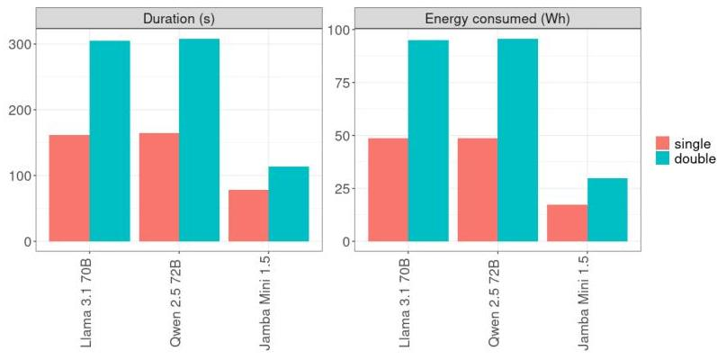
Fig. 4. Execution time breakdown.

occupies a certain amount of GPU memory, with the remainder available for intermediate data during fine-tuning. Longer sequence lengths consume more memory, and denser MoE configurations require additional memory space. We discuss the heuristic for determining the maximum batch size in  $\S V$ . Based on our experimental study on NVIDIA A40 GPU with 48GB memory, we empirically find and report the maximum batch size supported by different model and dataset combinations in Table III.

2) Execution Time Breakdown: We first analyze the high-level execution time breakdown for Mixtral and BlackMamba. The purpose of this study is to understand where does this workload spend most of its time. As discussed in §III, we conduct this study using a sequence length of 128.

At a high-level, the fine-tuning workload can be divided into three stages: (1) forward, (2) backward, and (3) optimizer. We use a batch size of 1 and the maximum batch size supported by a model-dataset combination to show workload characteristics. Fig. 4 illustrates the following insights. (1) The optimizer stage in BlackMamba fine-tuning takes a considerable portion of the running time (up to  $53\%$  when conducting sparse fine-tuning with batch size  $= 1$ ), while the execution time share of the optimizer stage in Mixtral fine-tuning is negligible. The running time of the optimizer stage depends only on the number of parameters that need to be updated during fine-tuning. This difference is primarily due to the different fine-tuning strategies applied to these two models: only the parameters in the LoRA module are updated for Mixtral fine-tuning, whereas BlackMamba undergoes full fine-tuning. (2) The runtime of the forward and backward stages increases with sparsity and batch size due to the increased amount of computation. (3) The backward stage typically takes more time than the forward stage. In BlackMamba, the backward stage demands more computation than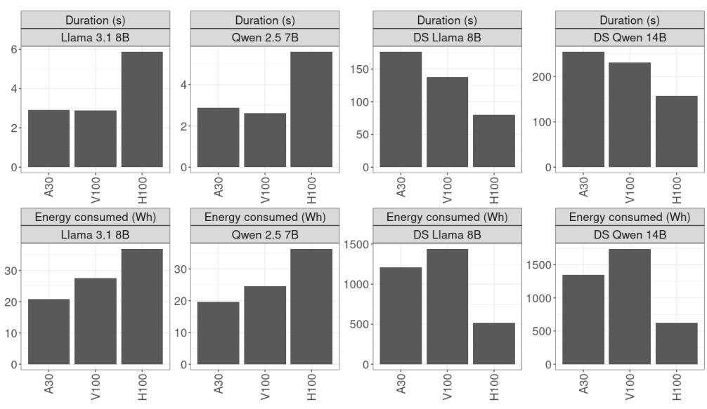
Fig. 5. Execution time breakdown in terms of different model layers.

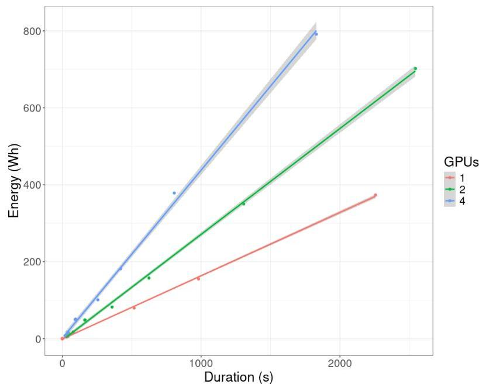
Fig. 6. Execution breakdown of the MoE layer for different kernels.

the forward stage due to the need for gradient calculation and propagation, resulting in two matrix multiplication operations. In Mixtral fine-tuning, gradient calculation adds minimal computation as only a small portion of parameters need it. However, gradient checkpointing in Mixtral saves memory but increases the backward stage runtime due to the re-computation of intermediate values.

We further investigate the execution breakdown based on various layers in two LLM models. For Mixtral, these layers include input normalization, attention, post-attention normalization, and MoE. In contrast, BlackMamba comprises the Mamba layer, Root Mean Squared (RMS) layer normalization, and MoE. As shown in Fig. 5, the MoE layer is the most time-consuming, accounting for  $85\%$  of the overall execution time on average. The execution time for the MoE layer encompasses both the forward and backward passes during fine-tuning. Consequently, MoE is the costliest layer and a prime target for optimization to enhance the performance of LLM fine-tuning.

To concretely understand the opportunity for improving MoE layer performance, we also perform a kernel-level analysis within the MoE layer. Fig. 7 illustrates the architecture of the MoE layer in both Mixtral and BlackMamba models. Each expert in BlackMamba consists of a standard Feed-Forward Network (FFN) layer with two serially connected weight matrices (W1 and W2) and a Gelu activation layer between. In contrast, experts in Mixtral are FFN layers with Swish-Gated Linear Units, involving an additional weight

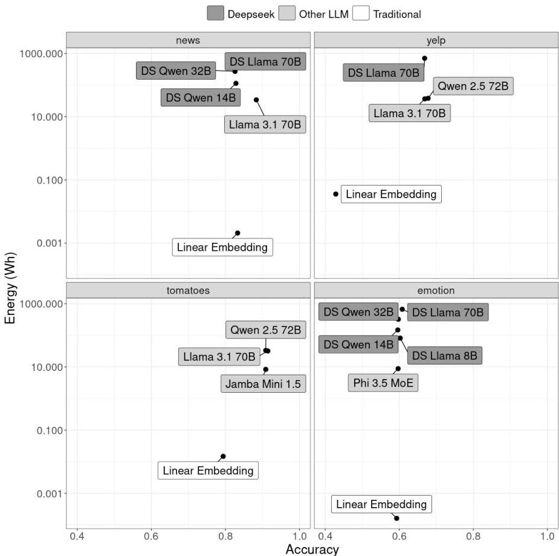

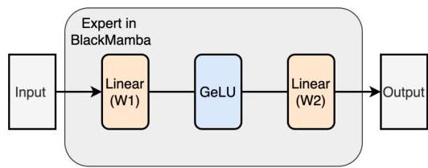
Fig. 7. Expert architectures for Mixtral (top) and BlackMamba (bottom).

matrix (W3) in parallel with W1.

Fig. 6 shows the kernel-level MoE time breakdown. The figure clearly shows that matrix multiplication (W1, W2, and W3) is the largest component of the MoE layer for both BlackMamba and Mixtral. As batch size and sparsity increase, so does computational demand, prolonging matrix multiplication latency. The de-quantization operation in Mixtral fine-tuning also becomes significant, especially with low sparsity and small batch sizes. While quantization reduces model size and memory footprint, it can increase computation time due to de-quantization. This highlights the need to evaluate trade-offs between memory savings and computation time, particularly in scenarios with small batch sizes and sequence lengths.

Takeaway 3. Matrix multiplication operations in the MoE layer contribute significantly to the end-to-end execution time, making the MoE layer the costliest component in LLM fine-tuning.

3) Fine-Tuning Throughput: Next, we present the fine-tuning throughput of Mixtral and BlackMamba on the MATH and CS datasets separately in Fig. 8. We use a throughput metric of queries/second processed, where a query includes a prompt and a ground-truth answer for fine-tuning. To obtain these results, we extract 1000 examples from each dataset and fine-tuned Mixtral and BlackMamba on them using the smallest batch size (batch size = 1) and the largest batch size that would fill the GPU memory.

As illustrated in Fig. 8, sparse fine-tuning achieves higher throughput than dense fine-tuning. This is because the sparse fine-tuning baseline consumes less memory to store intermediate values, which allows for higher batch sizes compared to its dense counterpart. Additionally, with the same batch size, sparse fine-tuning achieves higher throughput because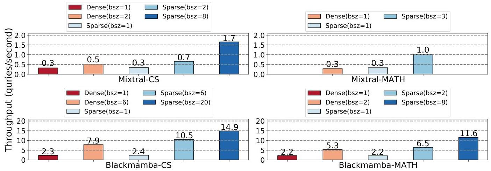
Fig. 8. Query throughput of Mixtral and BlackMamba.

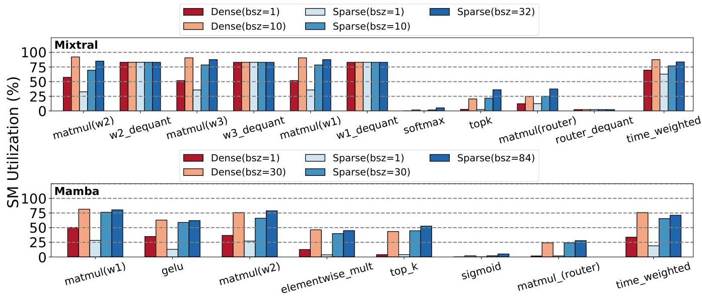
Fig. 9. GPU SM utilization of different kernels in the MoE layer for different batch sizes.

it involves fewer computational demands, resulting in lower latency. This is evident when comparing the throughput of batch size of 2 in Mixtral-CS for dense (0.5 qps) vs. sparse (0.7 qps) models.

Fig. 8 also shows that throughput does not increase linearly with batch size. For instance, sparse fine-tuning of Mixtral-CS improves throughput by  $1.9 \times$  when increasing the batch size from 1 to 2, but only by  $4.8 \times$  when increasing from 1 to 8. With smaller batch sizes, the SM utilization rate is lower, providing enough computational resources to feed more operations in parallel. However, as the batch size continues to increase, the SMs become saturated (more details in §IV-B4), and we can no longer hide latency by better utilizing computational resources.

Takeaway 4. Sparse model significantly improves throughput, reducing end-to-end cost of fine-tuning.

4) Hardware characterization: As shown in Fig. 4, the execution time of LLM fine-tuning is dominated by the MoE layer. To offer further insights, we use detailed microarchitecture hardware metrics on the GPU to further understand execution bottlenecks in the MoE layer. The goal of this study is to identify whether various kernels in the MoE layers are bound by compute or memory resources, and how future GPU designs can further scale performance.

Compute resource utilization study. Fig. 9 shows the kernel-level breakdown of GPU Streaming Multi-processor (SM) utilization for the MoE layer. This utilization is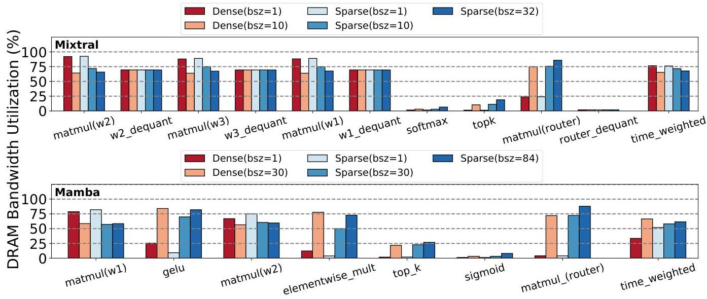
Fig. 10. GPU DRAM bandwidth utilization of different kernels in the MoE layer for different batch sizes.

weighted by the amount of time each kernel takes. We use a sequence length of 128 (§III). Sequence length will influence the choice of batch size, and we discuss the effects of sequence length on runtime, throughput, SM utilization, and memory utilization in §IV-B6. For dense fine-tuning, we show the SM utilization of batch size 1 and the maximum batch size that fits into memory; for sparse fine-tuning, we use the two batch sizes for dense fine-tuning, and the maximum batch size that fits into memory.

Fig. 9 shows the SM utilization of different kernels in the MoE layer, which offers the following insights. (1) For both sparse and dense fine-tuning, SM utilization increases with batch size due to higher parallelism and GPU activity. (2) Sparse fine-tuning has lower SM utilization than dense fine-tuning at the same batch size because it activates only 2 out of 8 experts, reducing parallelism. Consequently, sparse fine-tuning supports a higher maximum batch size. Both achieve similar maximum SM utilization at their peak batch sizes. (3) The de-quantization kernel maintains high SM utilization regardless of batch size. (4) Matrix multiplication kernels achieve higher SM utilization with larger batch sizes, leveraging the GPU's parallel processing capabilities.

Memory resource utilization study. Fig. 10 shows the kernel-level breakdown of GPU memory bandwidth utilization. We use the same experimental setup as in the evaluation of SM utilization, and find the following insights. (1) For both sparse and dense fine-tuning, the time-weighted memory utilization decreases with increasing batch size. This is because the model parameters are loaded once and shared by all queries in a batch. However, a larger batch increases the execution time (as discussed in §IV-B6), leading to a lower average memory bandwidth utilization.

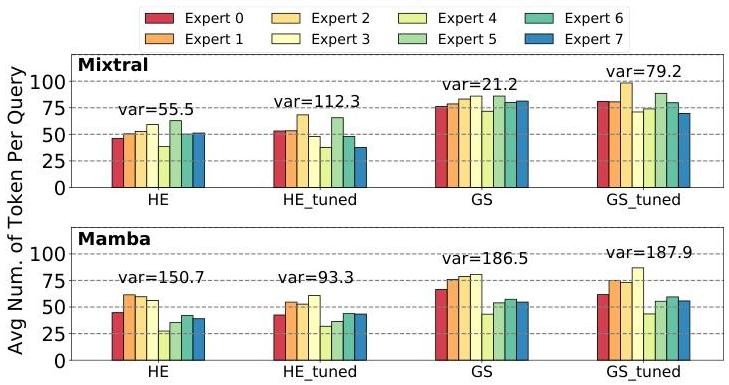
Fig. 11. Token distribution to different experts.

(2) For the same batch size, sparse fine-tuning achieves higher memory bandwidth utilization than dense fine-tuning due to shorter execution times. (3) Dequant layers' memory utilization is batch-size-independent, while matmul layers' utilization decreases with larger batch sizes. To maximize GPU memory usage, a sufficiently large batch size should be used. With large batch sizes, fine-tuning becomes compute-bound, indicating a need for improved compute resources in future hardware to better utilize memory bandwidth.

Takeaway 5. As the batch size increases, LLM fine-tuning transitions from being memory-bound to compute-bound.

5) Effect of Load Imbalance Due to Fine-Tuning: Recent trends in deploying expert parallelism in MoE models have highlighted load-imbalanced computation among experts as a significant issue impacting inference and training effi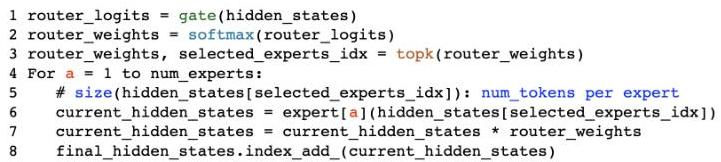
Fig. 12. Pseudo code for MoE layers.

ciency [27]. During the training process of MoE models, each token is dynamically assigned to the top-k experts based on routing scores. This strategy often leads to most tokens being assigned to a small number of experts, resulting in load imbalance and slower training. Additionally, some experts receive insufficient training, which degrades overall model performance [28]. A naive approach to address this imbalance is to use token dropping and padding to ensure that the number of tokens assigned to each expert is equal [29]. However, this method sacrifices model quality or leads to wasted computation. In this section, we analyze how fine-tuning influences the token distribution among experts. We compare the token distribution of Mixtral and BlackMamba before and after fine-tuning to understand the impact of this process.

We extract 1,000 examples from both the CS and MATH datasets to test the original models without tuning and the models after 10 epochs of tuning on these datasets. Fig. 12 provides the pseudo code for MoE layers with top-k gating. In this process, the hidden states are first sent to the router of the MoE layer, which generates router logits. These logits determine the priority of each expert for each token. Based on the router score for each token, tokens are grouped together and sent to their assigned experts. This top-k routing strategy can lead to load imbalance if the model has not been pretrained for balance.

Fig. 11 evidently shows that fine-tuning causes load imbalance in Mixtral for both datasets. Comparing variance before and after fine-tuning (e.g., HE vs. HE_tuned), the token assignment variance increased from 55 to 112 for CS and from 21 to 79 for GS. Expert 3 became the most frequently used and important expert post fine-tuning. Conversely, there is a decrease in the variance of token distribution for BlackMamba on the CS dataset, dropping from 150 to 93. For the GS dataset, the token distribution variance for BlackMamba remains almost unchanged after fine-tuning. This suggests that load-imbalance has a less disruptive impact on fine-tuning for BlackMamba compared to Mixtral. From Fig. 11, we can also observe that Mixtral demonstrates better load balance in both tasks compared to BlackMamba, despite the increased load imbalance after fine-tuning. The increased level of imbalance after fine-tuning suggests GPU load balancing techniques can be helpful. Both single GPU load balancing [30] and multi-GPU load balancing [31] have been proposed to address this issue.

Takeaway 6. The effect of fine-tuning on expert load imbalance in the MoE layer is LLM model and dataset dependent.

6) Sensitivity Study on Sequence Length: To further analyze the effect of sequence length on the fine-tuning process, we chose the batch size that would maximize the memory for each sequence length (64, 128, 256, 512, and 1024) and compared the latency, SM utilization, and DRAM utilization. Our evaluation (the figure is omitted from the paper due to page limitation) shows that the latency for Mixtral remains almost constant across different sequence lengths, while BlackMamba fine-tuning exhibited a slight reduction in latency as sequence length increased, with approximately  $19\%$  and  $25\%$  decreases for sparse and dense fine-tuning, respectively. This is due to the varying maximum batch sizes supported by each sequence length, resulting in a similar number of tokens in each batch. Because latency remains consistent with increasing sequence length and we can use larger batch sizes, throughput is higher for shorter sequences.

# V. ANALYTICAL MODEL TO ESTIMATE THE COST OF FINE-TUNING LLMS

While training LLMs from scratch is a cost-prohibitive process, fine-tuning LLMs offers an attractive solution to align LLMs to desired behaviors. One such example is fine-tuning LLMs to a domain-specific use-cases, for example, to answer math questions. §IV-A shows that it is possible to fine-tune pre-trained LLMs on domain-specific tasks to significant improve accuracy. While this is a desired approach, currently, no model exists that can predict the cost of fine-tuning LLMs.

Fine-tuning LLMs is complex, influenced by factors like model size, GPU memory, dataset sequence length, and MoE sparsity, all affecting batch size and throughput. By integrating these factors with GPU costs, we can identify the most cost-efficient GPU for pre-tuning tasks. This section presents an analytical model based on previous characterization.

This model estimates cloud-based fine-tuning costs for a given dataset and LLM. Developed from previous sections, it can be adapted for other LLMs by adjusting parameters. It assumes using the maximum batch size supported by GPU memory to optimize cost. We first estimate this batch size, then use it to evaluate throughput and fine-tuning costs.

# A. Estimating Maximum Batch Size

The maximum batch size is the maximum number of queries that can fit in GPU memory at once. Our analytical model for maximum batch size is shown in (1).

$$
M a x _ {B} S Z = \left\lfloor C _ {0} * \frac {G P U _ {\text {m e m}} - m o d e l _ {\text {m e m}}}{\text {s e q} _ {\text {l e n}} * \left(\left(1 - C _ {1}\right) + C _ {1} * \text {s p a r s i t y}\right)} \right\rfloor \tag {1}
$$

Intuitively, larger GPU memory allows for higher batch sizes. In the meantime, the LLM model will take up a certainamount of GPU memory, and need to be subtracted in the analytical model. Fig. 8 supports this by showing that on the same dataset, BlackMamba can support larger batch size than Mixtral because of its smaller model size.

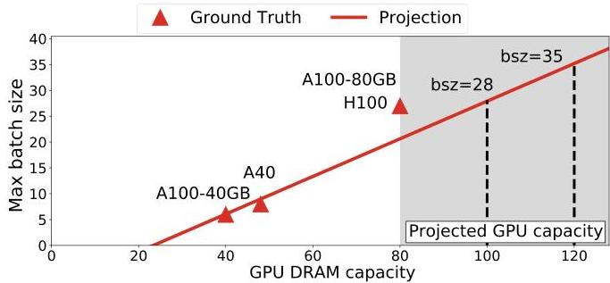
Figure 13: Projected maximum batch size of Mixtral for different GPUs.

Moreover, the sequence length and sparsity also affect the maximum batch size. Because the sparsity only affects the MoE part of the LLM, we multiply its influence by $C_{1}$, which we call *MoE coefficient*. We apply the sequence length and the sparsity in the denominator as they are inversely related to batch size. Then, we multiply the result by $C_{0}$, the *scaling coefficient*, which scales the batch size by a constant. The *scaling coefficient* is different across LLM models, because different models have different architecture (§III), and generate different amounts of intermediate data for each query. The *scaling coefficient* for BlackMamba is higher than that of Mixtral because it is a smaller model. Finally, we use floor to round it to the maximum integer.

The *MoE coefficient* and *scaling coefficient* vary across models. These coefficients are independent of GPU microarchitectural parameters. We find the maximum batch size for both LLM models on NVIDIA A40 (48GB), A100 (40GB), A100 (80GB), and H100 (80GB), and apply our model to find the optimal coefficients. For Mixtral, $C_{0}=82$ and $C_{1}=0.95$, and for BlackMamba, $C_{0}=83$ and $C_{1}=0.88$. While we showcase these parameters for the models evaluated, §V-D discusses how to generalize this approach for other models.

Using our analytical model, we demonstrate the maximum batch sizes for fine-tuning on four different NVIDIA GPUs: A40, A100-40GB, A100-80GB and H100 with memory capacities of 48GB, 40GB, 80GB, and 80GB, respectively. Fig. 13 shows our projected maximum batch size and correlate it with experimented ground truth. While the maximum memory capacity available in NVIDIA GPUs today is 80GB, we use our analytical model to project the maximum batch size that future GPUs might support. For GPU memory capacities of 100GB and 120GB, our model predicts that the maximum batch sizes supported for fine-tuning Mixtral will be 28 and 35, respectively. Due to space limitations, we only show the projection of Mixtral model.

TABLE IV: Estimated cost of fine-tuning Mixtral on GS with sparse MoE based on our analytical model

|  GPU | Mem | MBS | Throughput | Cost ($/hr) | Cost ($)  |
| --- | --- | --- | --- | --- | --- |
|  A40 | 48GB | 4 | 1.01 | 0.79 | 32.7  |
|  A100 | 80GB | 17 | 2.74 | 1.67 | 25.4  |
|  H100 | 80GB | 17 | 4.90 | 2.1 | 17.9  |

### IV-B Estimating Throughput

As discussed in §IV-B4, when the batch size increases, the LLM fine-tuning gradually switches from memory bound to compute bound. When the compute resources are abundant, the throughput increases almost linearly with batch size. However, when compute resources become constrained, the throughput improvement gradually saturates. We model this behavior using a logarithmic relation between batch size and throughput. Our analytical model for maximum batch size is shown in (2).

$Throughput=C_{2}*log(\frac{batch\_size}{sparsity*C3})+C_{4}$ (2)

In the equation, in addition to the basic logarithmic part, we have three coefficients $C_{2}$, $C_{3}$, and $C_{4}$. $C_{2}$ is the *scaling coefficient*, which depends on the LLM model, GPU architecture, and the dataset. The higher the compute capability a GPU can provide, and the lower the LLM model and dataset compute requirement is, the higher the *scaling coefficient* will be. $C_{3}$ is the *MoE attenuation coefficient*, which tunes how much the MoE sparsity affects the throughput. MoE sparsity only affects the MoE part in LLM model, and thus should be attenuated to avoid over compensation. This coefficient is only LLM model dependent, because once the model is fixed, the influence of sparsity is determined. C4 is the *intercept*, conceptually it equals to the throughput when batch size equals one, because the logarithmic part in (2) is zero when batch size is one. Using scipy *[32]* to fit the model and generate four sets $(C_{2},C_{3},C_{4})$, for each model and dataset combination.

To estimate the accuracy of this model, we correlate the model output with experimental data from our study. Fig. 14 shows this correlation study, where discrete data points (dots) represent experimental values, and the line represents output of our analytical model. We use both dense and sparse Mixtral and BlackMamba for both datasets used in our study. The figure clearly shows that our model accurately predicts LLM fine-tuning throughput with a Root Mean Squared Error (RMSE) of less than 0.8. Fig. 15 shows the correlation study of the analytical model of three other GPUs, A100 (40GB), A100 (80GB), and H100. The RMSE is less than 0.6, close to that of A40.

### IV-C Estimating the Total Fine-Tuning Cost

Using the throughput estimation, we calculate the cost of fine-tuning LLMs for different GPUs. The cost of GPU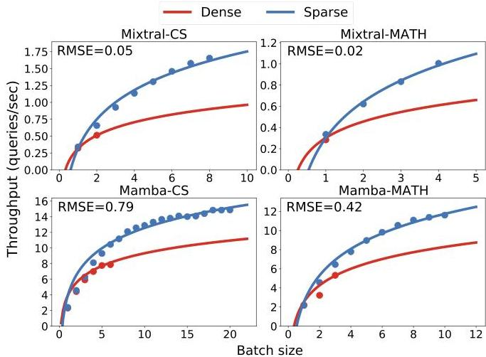
Fig. 14. Estimation and validation of LLM fine-tuning throughput for different models, datasets for A40 GPU. Dots represent ground truth and lines present the estimation.

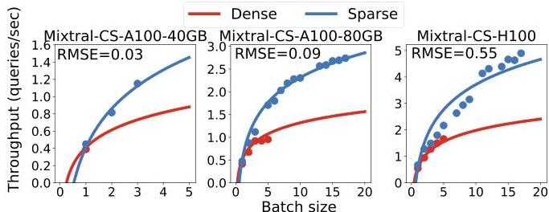
Fig. 15. Estimation and validation of fine-tuning throughput for Mixtral GS for different GPUs: A100 and H100.

resource renting per hour is calculated based on CUDO compute [33], as other popular cloud providers do not offer cost/hour rates for the NVIDIA A40 GPU. However, one can easily adjust the GPU renting cost per hour to estimate the cost on other clouds such as Amazon AWS [34] or Lambda [35]. Table IV estimates the cost for fine-tuning Mixtral on the MATH dataset with a sparse setup, using 10 epochs on different GPUs for a realistic cost estimate. Enterprises may use larger datasets for fine-tuning, such as, OpenOrca [36] and LaMini-instruction [37] containing more than 2M queries. For OpenOrca, by scaling the cost by number of queries, our model predicts that the most cost-effective option to rent GPU resources on CUDO compute is NVIDIA H100 with a net cost of $3460.

# D. Generalization of the Analytical Model

The analytical models for estimating maximum batch size and throughput can be generalized to various LLM models and datasets. These models consider the characteristics of the LLM, dataset, and GPU. Specifically, the maximum batch size model combines GPU memory and LLM model size to determine available memory for input data, while dataset sequence length and LLM sparsity determine space

needed per batch. In throughput estimation, based on the observation we made (§IV-B4 Takeaway 5), GPU shifts from memory-bound to compute-bound as batch size increases. This characteristic generally applies to all GPUs due to the resource constraint, so the logarithmic relation between batch size and throughput persists. The sparsity in (2) is model dependent, the influence of GPU, LLM model, and dataset are embedded in the coefficients  $C_2$ ,  $C_3$ , and  $C_4$  in (2).

The coefficients in (1) and (2) are dependent on GPU, LLM model, and dataset; however, the underlying models are generalizable to unseen GPU, LLM model, and datasets. Although it takes some effort to sweep batch sizes and collect throughput data points to fit our models, the benefits greatly outweigh the cost. Once the models are fit, our model can help choose the most cost-efficient GPU for fine-tuning LLM models, greatly saving resources and money.

# VI. RELATED WORKS

Parameter-Efficient Fine-Tuning (PEFT) has been widely adopted to fine-tune LLM model for specialized tasks [15], [38]–[43]. MoE additionally train specialized experts for different areas and the dynamic selection of experts makes it possible to scale the fine-tuning workload to different experts in parallel. [44]–[47] show that MoE models can improve the ability to process knowledge for specific tasks, while maintaining the world knowledge in LLM. Kim et al. [48] construct an analytical model to estimate GPU memory consumption for distributed fine-tuning. The model also provides insights into optimizing memory usage through tensor, model, and pipeline parallelism.

# VII. CONCLUSIONS

Fine-tuning LLMs is an attractive technique for tailoring modern language models using domain-specific knowledge in a cost-effective manner. This paper delved into understanding the performance of fine-tuning MoE LLM models on a single GPU. Our profiling demonstrated that sparse MoE layers offer the best bang-for-buck trade-off. Using our profiling results, we developed and validated an accurate analytical model to estimate the cost of LLM fine-tuning. Using this model, we showed the dollar amount that needs to be budgeted for fine-tuning LLMs, which is much lower than pre-training. For example, our model predicted that fine-tuning a sparse Mixtral model using a realistic data size of 2M queries can be done with NVIDIA H100 GPU with a cost of $3460. A way to further reduce cost based on our study is to add compute resources to accelerate the MoE layers. While we showcase our study on fine-tuning LLMs using a single GPU, extending this model to multi-GPU systems is left for future exploration.

# ACKNOWLEDGMENTS

This work was supported in part by Semiconductor Research Corporation (SRC). We thank all the anonymous reviewers for their valuable comments and suggestions.References

- [1] Jason Wei, Yi Tay, Rishi Bommasani, Colin Raffel, Barret Zoph, Sebastian Borgeaud, Dani Yogatama, Maarten Bosma, Denny Zhou, Donald Metzler, Ed H. Chi, Tatsunori Hashimoto, Oriol Vinyals, Percy Liang, Jeff Dean, and William Fedus. Emergent abilities of large language models, 2022.
- [2] Longteng Zhang, Xiang Liu, Zeyu Li, Xinglin Pan, Peijie Dong, Ruibo Fan, Rui Guo, Xin Wang, Qiong Luo, Shaohuai Shi, and Xiaowen Chu. Dissecting the runtime performance of the training, fine-tuning, and inference of large language models, 2023.
- [3] Hugo Touvron, Thibaut Lavril, Gautier Izacard, Xavier Martinet, Marie-Anne Lachaux, Timothée Lacroix, Baptiste Rozière, Naman Goyal, Eric Hambro, Faisal Azhar, Aurelien Rodriguez, Armand Joulin, Edouard Grave, and Guillaume Lample. Llama: Open and efficient foundation language models, 2023.
- [4] Albert Q. Jiang, Alexandre Sablayrolles, Antoine Roux, Arthur Mensch, Blanche Savary, Chris Bamford, Devendra Singh Chaplot, Diego de las Casas, Emma Bou Hanna, Florian Bressand, Gianna Lengyel, Guillaume Bour, Guillaume Lample, Lélio Renard Lavaud, Lucile Saulnier, Marie-Anne Lachaux, Pierre Stock, Sandeep Subramanian, Sophia Yang, Szymon Antoniak, Teven Le Scao, Théophile Gervet, Thibaut Lavril, Thomas Wang, Timothée Lacroix, and William El Sayed. Mixtral of experts, 2024.
- [5] Hyung Won Chung, Le Hou, Shayne Longpre, Barret Zoph, Yi Tay, William Fedus, Yunxuan Li, Xuezhi Wang, Mostafa Dehghani, Siddhartha Brahma, Albert Webson, Shixiang Shane Gu, Zhuyun Dai, Mirac Suzgun, Xinyun Chen, Aakanksha Chowdhery, Alex Castro-Ros, Marie Pellat, Kevin Robinson, Dasha Valter, Sharan Narang, Gaurav Mishra, Adams Yu, Vincent Zhao, Yanping Huang, Andrew Dai, Hongkun Yu, Slav Petrov, Ed H. Chi, Jeff Dean, Jacob Devlin, Adam Roberts, Denny Zhou, Quoc V. Le, and Jason Wei. Scaling instruction-finetuned language models, 2022.
- [6] Vladislav Lialin, Vijeta Deshpande, and Anna Rumshisky. Scaling down to scale up: A guide to parameter-efficient fine-tuning, 2023.
- [7] Jiaao Chen, Aston Zhang, Xingjian Shi, Mu Li, Alex Smola, and Diyi Yang. Parameter-efficient fine-tuning design spaces, 2023.
- [8] Quentin Anthony, Yury Tokpanov, Paolo Glorioso, and Beren Millidge. Blackmamba: Mixture of experts for state-space models, 2024.
- [9] Alec Radford, Karthik Narasimhan, Tim Salimans, Ilya Sutskever, et al. Improving language understanding by generative pre-training. 2018.
- [10] Introducing chatgpt. https://openai.com/index/chatgpt.
- [11] Josh Achiam et.al. Gpt-4 technical report, 2024.
- [12] Introducing the next generation of claude. https://www.anthropic.com/news/claude-3-family.
- [13] Albert Q. Jiang, Alexandre Sablayrolles, Arthur Mensch, Chris Bamford, Devendra Singh Chaplot, Diego de las Casas, Florian Bressand, Gianna Lengyel, Guillaume Lample, Lucile Saulnier, Lélio Renard Lavaud, Marie-Anne Lachaux, Pierre Stock, Teven Le Scao, Thibaut Lavril, Thomas Wang, Timothée Lacroix, and William El Sayed. Mistral 7b, 2023.
- [14] Edward J. Hu, Yelong Shen, Phillip Wallis, Zeyuan Allen-Zhu, Yuanzhi Li, Shean Wang, Lu Wang, and Weizhu Chen. Lora: Low-rank adaptation of large language models, 2021.
- [15] Tim Dettmers, Artidoro Pagnoni, Ari Holtzman, and Luke Zettlemoyer. Qlora: Efficient finetuning of quantized llms, 2023.
- [16] Amin Vahdat. Societal infrastructure in the age of artificial general intelligence. ASPLOS 2024 Keynote, 2024.
- [17] Tri Dao. Flashattention-2: Faster attention with better parallelism and work partitioning, 2023.
- [18] Tianqi Chen, Bing Xu, Chiyuan Zhang, and Carlos Guestrin. Training deep nets with sublinear memory cost, 2016.
- [19] Yaowei Zheng, Richong Zhang, Junhao Zhang, Yanhan Ye, Zheyan Luo, and Yongqiang Ma. Llamafactory: Unified efficient fine-tuning of 100+ language models. arXiv preprint arXiv:2403.13372, 2024.
- [20] Zhiqiang Hu, Lei Wang, Yihuai Lan, Wanyu Xu, Ee-Peng Lim, Lidong Bing, Xing Xu, Soujanya Poria, and Roy Ka-Wei Lee. Llm-adapters: An adapter family for parameter-efficient fine-tuning of large language models, 2023.
- [21] Karl Cobbe, Vineet Kosaraju, Mohammad Bavarian, Mark Chen, Heewoo Jun, Lukasz Kaiser, Matthias Plappert, Jerry Tworek, Jacob Hilton, Reiichiro Nakano, Christopher Hesse, and John Schulman. Training verifiers to solve math word problems. arXiv preprint arXiv:2110.14168, 2021.
- [22] Rowan Zellers, Ari Holtzman, Yonatan Bisk, Ali Farhadi, and Yejin Choi. Hellaswag: Can a machine really finish your sentence? In Proceedings of the 57th Annual Meeting of the Association for Computational Linguistics, 2019.
- [23] Nvidia nsight compute. https://developer.nvidia.com/nsight-compute.
- [24] Janice Ahn, Rishu Verma, Renze Lou, Di Liu, Rui Zhang, and Wenpeng Yin. Large language models for mathematical reasoning: Progresses and challenges, 2024.
- [25] Albert Gu and Tri Dao. Mamba: Linear-time sequence modeling with selective state spaces, 2024.
- [26] Fuzhao Xue, Xiaoxin He, Xiaozhe Ren, Yuxuan Lou, and Yang You. One student knows all experts know: From sparse to dense, 2022.
- [27] Changho Hwang, Wei Cui, Yifan Xiong, Ziyue Yang, Ze Liu, Han Hu, Zilong Wang, Rafael Salas, Jithin Jose, Prabhat Ram, Joe Chau, Peng Cheng, Fan Yang, Mao Yang, and Yongqiang Xiong. Tutel: Adaptive mixture-of-experts at scale. CoRR, abs/2206.03382, June 2022.
- [28] Noam Shazeer, Azalia Mirhoseini, Krzysztof Maziarz, Andy Davis, Quoc Le, Geoffrey Hinton, and Jeff Dean. Outrageously large neural networks: The sparsely-gated mixture-of-experts layer, 2017.
- [29] Dmitry Lepikhin, HyoukJoong Lee, Yuanzhong Xu, Dehao Chen, Orhan Firat, Yanping Huang, Maxim Krikun, Noam Shazeer, and Zhifeng Chen. Gshard: Scaling giant models with conditional computation and automatic sharding, 2020.
- [30] Long Chen, Oreste Villa, Sriram Krishnamoorthy, and Guang R. Gao. Dynamic load balancing on single- and multi-gpu systems. In 2010 IEEE International Symposium on Parallel & Distributed Processing (IPDPS), pages 1–12, 2010.
- [31] Mohamed Wahib, Muhammet Abdullah Soytürk, and Didem Unat. Elastic load balancing for dynamic LLMs, 2024.
- [32] Pauli Virtanen, Ralf Gommers, Travis E. Oliphant, Matt Haberland, Tyler Reddy, David Cournapeau, Evgeni Burovski, Pearu Peterson, Warren Weckesser, Jonathan Bright, Stéfan J. van der Walt, Matthew Brett, Joshua Wilson, K. Jarrod Millman, Nikolay Mayorov, Andrew R. J. Nelson, Eric Jones, Robert Kern, Eric Larson, C J Carey, İlhan Polat, Yu Feng, Eric W. Moore, Jake VanderPlas, Denis Laxalde, Josef Perktold, Robert Cimrman, Ian Henriksen, E. A. Quintero, Charles R. Harris, Anne M. Archibald, António H. Ribeiro, Fabian Pedregosa, Paul van Mulbregt, and SciPy 1.0 Contributors. SciPy 1.0: Fundamental Algorithms for Scientific Computing in Python. Nature Methods, 17:261–272, 2020.
- [33] CUDO compute: https://www.cudocompute.com.
- [34] Amazon AWS: https://aws.amazon.com.
- [35] Lambda: https://www.gpus.com.
- [36] Subhabrata Mukherjee, Arindam Mitra, Ganesh Jawahar, Sahaj Agarwal, Hamid Palangi, and Ahmed Awadallah. Orca: Progressive learning from complex explanation traces of gpt-4, 2023.
- [37] Minghao Wu, Abdul Waheed, Chiyu Zhang, Muhammad Abdul-Mageed, and Alham Fikri Aji. Lamini-lm: A diverse herd of distilled models from large-scale instructions, 2024.
- [38] Edward J Hu, Yelong Shen, Phillip Wallis, Zeyuan Allen-Zhu, Yuanzhi Li, Shean Wang, Lu Wang, and Weizhu Chen. Lora: Low-rank adaptation of large language models. arXiv preprint arXiv:2106.09685, 2021.
- [39] Neil Houlsby, Andrei Giurgiu, Stanislaw Jastrzebski, Bruna Morrone, Quentin De Laroussilhe, Andrea Gesmundo, Mona Attariyan, and Sylvain Gelly. Parameter-efficient transfer learning for nlp. In International conference on machine learning, pages 2790–2799. PMLR, 2019.
- [40] Shwai He, Liang Ding, Daize Dong, Jeremy Zhang, and Dacheng Tao. SparseAdapter: An easy approach for improving the parameter-efficiency of adapters. In Yoav Goldberg, Zornitsa Kozareva, and Yue Zhang, editors, Findings of the Association for Computational Linguistics: EMNLP 2022, pages 2184–2190, Abu Dhabi, United Arab Emirates, December 2022. Association for Computational Linguistics.
- [41] Shih-Yang Liu, Chien-Yi Wang, Hongxu Yin, Pavlo Molchanov, Yu-Chiang Frank Wang, Kwang-Ting Cheng, and Min-Hung Chen. Dora: Weight-decomposed low-rank adaptation, 2024.[42] Jiawei Zhao, Zhenyu Zhang, Beidi Chen, Zhangyang Wang, Anima Anandkumar, and Yuandong Tian. Galore: Memory-efficient llm training by gradient low-rank projection, 2024.
- [43] Ting Jiang, Shaohan Huang, Shengyue Luo, Zihan Zhang, Haizhen Huang, Furu Wei, Weiwei Deng, Feng Sun, Qi Zhang, Deqing Wang, and Fuzhen Zhuang. Mora: High-rank updating for parameter-efficient fine-tuning, 2024.
- [44] Bowen Pan, Yikang Shen, Haokun Liu, Mayank Mishra, Gaoyuan Zhang, Aude Oliva, Colin Raffel, and Rameswar Panda. Dense training, sparse inference: Rethinking training of mixture-of-experts language models. arXiv preprint arXiv:2404.05567, 2024.
- [45] Shihan Dou, Enyu Zhou, Yan Liu, Songyang Gao, Jun Zhao, Wei Shen, Yuhao Zhou, Zhiheng Xi, Xiao Wang, Xiaoran Fan, Shiliang Pu, Jiang Zhu, Rui Zheng, Tao Gui, Qi Zhang, and Xuanjing Huang. Loramoe: Alleviate world knowledge forgetting in large language models via moe-style plugin, 2024.
- [46] Yanqi Zhou, Tao Lei, Hanxiao Liu, Nan Du, Yanping Huang, Vincent Zhao, Andrew Dai, Zhifeng Chen, Quoc Le, and James Laudon. Mixture-of-experts with expert choice routing, 2022.
- [47] Damai Dai, Chengqi Deng, Chenggang Zhao, R. X. Xu, Huazuo Gao, Deli Chen, Jiashi Li, Wangding Zeng, Xingkai Yu, Y. Wu, Zhenda Xie, Y. K. Li, Panpan Huang, Fuli Luo, Chong Ruan, Zhifang Sui, and Wenfeng Liang. Deepseekmoe: Towards ultimate expert specialization in mixture-of-experts language models, 2024.
- [48] Taeho Kim, Yanming Wang, Vatshank Chaturvedi, Lokesh Gupta, Seyeon Kim, Yongin Kwon, and Sangtae Ha. Llmem: Estimating gpu memory usage for fine-tuning pre-trained llms, 2024.Appendix

### A-A Abstract

This artifact reproduces the results presented in the Characterization Study. It includes a detailed three-level runtime breakdown, analysis of SM and MEM utilization, and a comprehensive study of throughput.

### A-B Artifact check-list (meta-information)

- Compilation: PyTorch
- Model: Mixtral-8x7B and BlackMamba-630M/2.8B
- Data set: Hellaswag, GSM8k, MATH_14k and commonsense_15k (provided in GitHub repository)
- Run-time environment: Ubuntu 20.04.6
- Hardware: NVIDIA A40 (48GB) GPU
- Output: Nsight Compute
- Experiments: Fine-tune both models using different batch sizes and conduct a GPU characterization study
- How much disk space required (approximately)?: 100GB
- How much time is needed to prepare workflow (approximately)?: 1 hour
- How much time is needed to complete experiments (approximately)?: Throughput and Runtime Breakdown experiments can be completed within 2 hours, while Nsight Compute profiling for SM and MEM utilization will take approximately 80 hours
- Publicly available?: Yes
- Workflow framework used?: LLaMA-Factory

### A-C Description

#### A-C1 How to access

Our source code can be found at https://github.com/stssxx/finetune

#### A-C2 Hardware dependencies

- We conducted all experiments on a server equipped with an Intel® Xeon® Platinum 8380 CPU @ 2.30GHz and an NVIDIA A40 (48GB) GPU
- Supported GPUs should have at least 48GB of memory and feature an Ampere architecture or newer

#### A-C3 Software dependencies

- A recent Linux release
- Python 3.8.10
- CUDA 11.8
- PyTorch 2.1.0 compatible with CUDA 11.8
- CUDA toolkit 11.8

#### A-C4 Data sets

Hellaswag, GSM8k, MATH_14k and commonsense_15k. We provide all of them in our GitHub repository.

#### A-C5 Models

Mixtral-8x7B and BlackMamba-630M/2.8B. We provide the python script to download them from Huggingface. Mixtral-8x7B is a gated model, access request should be submitted here https://huggingface.co/mistralai/Mixtral-8x7B-v0.1.

### A-D Installation

For the Python environment, simply clone our repository and use conda to set up a new environment by running the following command:

```
#create a new conda environment
conda create --name=ft python=3.8
conda activate ft

#install pytorch2.1.0+cu118
conda install pytorch==2.1.0 \
torchvision==0.16.0 torchaudio==2.1.0 \
pytorch-cuda=11.8 -c pytorch -c nvidia

#download the source code
git clone https://github.com/stssxx
/finetune.git
cd finetune

#install all other dependencies
pip install -r requirements.txt
```

### A-E Experiment workflow

First make sure the working directory is the LLaMA-Factory directory:

```
cd LLaMA-Factory
```

Before running experiments, you should download both two models from Huggingface:

```
#Add Blackmamba directory to your pythonpath
export PYTHONPATH=$PYTHONPATH:../BlackMamba

#specify where you want to store models
export HF_HOME="path"

#download models, huggingface access token
should be entered in the terminal
python3 model_download.py
```

Make sure you change the transformers library path and model config file path before running each experiment bash script, you can find an example in the README file:

```
# change it to your transformers library path
transformers_path="xxxxx"

# change it to your model config path
config_file_path="xxxxx"
```

To reproduce the fine-tuning throughput results shown in Fig. 8, you can run the following scripts:

```
./mixtral_tp.sh
python3 throughput.py ./profile_data/mixtral
/throughput > mixtral_throughput.txt

./mamba_tp.sh
python3 throughput.py ./profile_data
/blackmamba/throughput > mamba_throughput.txtHigh-level and layer-level latency breakdown results shown in Fig. 4 and 5 can be obtained by running:

./mixtral_lt.sh

python3 mixtral_latency.py ./profile_data
/mixtral/latency > mixtral_latency_breakdown.txt

./mamba_lt.sh
python3 mamba_latency.py ./profile_data
/blackmamba/latency > mamba_latency_breakdown.txt

You can also use Nsight Compute to profile and generate kernel-level latency breakdown, SM and MEM utilization results shown in Fig. 6, 9 and 10 by running:

./mixtral_pf.sh
python3 sm_mixtral.py ./profile_data/mixtral
/ncu > mixtral_sm.txt
python3 mem_mixtral.py ./profile_data/mixtral
/ncu > mixtral_mem.txt

./mamba_pf.sh
python3 sm_mamba.py ./profile_data/blackmamba
/ncu > mamba_sm.txt
python3 mem_mamba.py ./profile_data/blackmamba
/ncu > mamba_mem.txt
python3 sm_mamba_back.py ./profile_data
/blackmamba/ncu_back > mamba_sm_backward.txt
python3 mem_mamba_back.py ./profile_data
/blackmamba/ncu_back > mamba_mem_backward.txt

### F- Evaluation and expected results

The generated results are stored in specific text files as indicated in the commands above, such as mixtral_sm.txt for SM utilization data of the Mixtral model.

### G- Experiment customization

Customized experiments can be conducted with varying batch sizes and query sequence lengths, both of which can be adjusted in each bash script.

### H- Methodology

Submission, reviewing and badging methodology:

- https://www.acm.org/publications/policies/
artifact-review-and-badging-current
- https://cTuning.org/ae